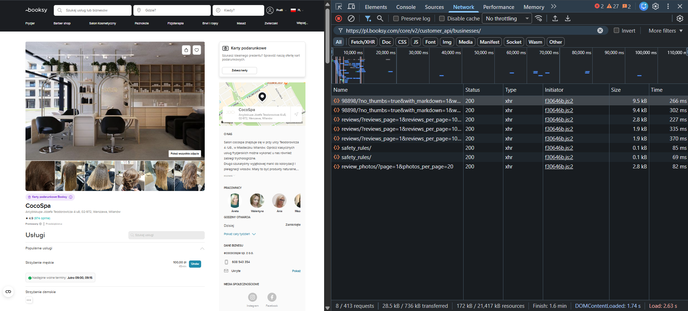
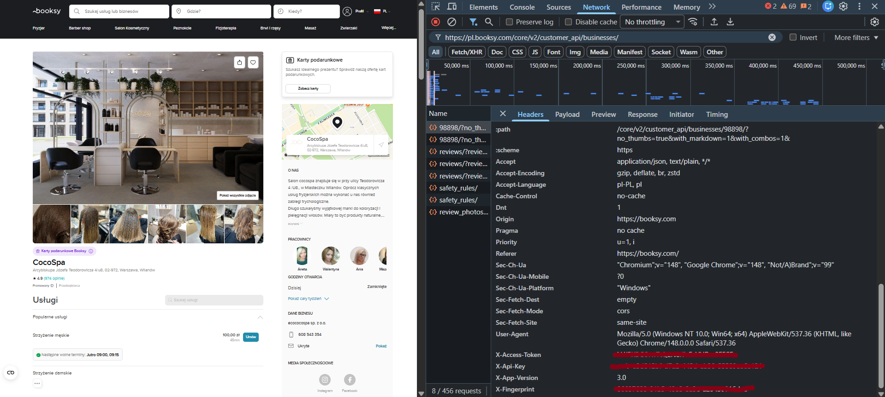

# Warsaw Beauty Salon Explorer

Home task for **SumUp Warsaw Accelerator Program - Software Engineer Intern**.

This repository contains a full working application with:
- data collection (`data-collection/`)
- backend API (`backend/`)
- frontend UI (`frontend/`)

The project is focused on Warsaw hair/beauty salons and covers the flow end-to-end: scrape -> store -> expose API -> browse and edit in UI.

## Project Walkthrough Video

I recorded a short walkthrough where I explain the most interesting implementation details in more depth:

- https://youtu.be/I0jIn95kxFI

## Stack

- Data collection: `Python`, `Scrapy`, `PyMongo`
- Backend: `Kotlin`, `Spring Boot`, `Spring Security`, `MongoDB`, `JWT`
- Frontend: `Next.js`, `TypeScript`, `Axios`, `Tailwind CSS`, `react-toastify`
- Infra/runtime: `Docker Compose`

## Repository Structure

- `data-collection/` scraper for Booksy data
- `backend/` REST API + auth/authorization
- `frontend/` Next.js application
- `docker-compose.yml` services: MongoDB, Mongo Express, backend, frontend

## Features Implemented

### Part 1 - Data Collection

- Scrapes Warsaw beauty/hair salons from Booksy
- Stores results in MongoDB (`salons.salons` collection)
- Uses upsert by `booksy_business_id` to avoid exact duplicates on re-runs
- Collects:
  - name
  - address
  - district
  - phone (when available)
  - email / social links (when available)
  - services
  - rating + reviews count
  - price information per service (used later for list min/max price)

Notes:
- Scraper is intentionally not containerized in this project because this is a one-time/manual ingestion workflow.


### Part 2 - Backend API

Exposed endpoints:

- `GET /api/salons?page=1&name=&district=&serviceType=`
  - paginated list with key fields
- `GET /api/salons/{booksyBusinessId}`
  - full salon details
- `PUT /api/salons/{booksyBusinessId}`
  - full update of editable salon fields
- `POST /api/auth/register`
- `POST /api/auth/login`

Authorization model:
- public read access (`GET`)
- `PUT /api/salons/**` requires JWT with role `ADMIN`
- newly registered users get role `USER` by default
- admin role is assigned manually in DB (intentional security choice for this assignment)

### Part 3 - Frontend UI

- Listing page with salon cards
- Pagination
- Filters: name, district, service type
- Salon details page
- Auth pages: register/login
- JWT persisted in local storage
- Navbar reflects auth state (`Login/Register` vs `Hello, {username}/Logout`)
- Edit salon page:
  - only admins can access edit form
  - non-admins see access denied message
  - full editable form including dynamic services
  - update request sent to backend
  - success/error notifications via toast

## How to Run

## 1) Prerequisites

- Docker + Docker Compose installed
- Create `.env` in repository root (for quick local setup you can copy content from `.env.dev`)

Required env values:
- `MONGO_INITDB_ROOT_USERNAME`
- `MONGO_INITDB_ROOT_PASSWORD`
- `MONGO_PORT`
- `JWT_SECRET`

## 2) Start app stack (DB + backend + frontend)

From repository root:

```bash
docker compose up -d --build
```

Services:
- Frontend: `http://localhost:3000`
- Backend: `http://localhost:8085`
- Mongo Express: `http://localhost:8081`

## 3) Seed database from dump (optional)

If you want to start with pre-collected data, restore the Mongo dump after the stack is running.

From repository root:

```bash
docker exec -i mongodb mongorestore \
  --username "$MONGO_INITDB_ROOT_USERNAME" \
  --password "$MONGO_INITDB_ROOT_PASSWORD" \
  --authenticationDatabase admin \
  --archive --gzip < seed-data/salons-and-users.archive.gz
```

`$MONGO_INITDB_ROOT_USERNAME` and `$MONGO_INITDB_ROOT_PASSWORD` should match the values you set in your root `.env` file.

## 4) Run scraper manually

Scraper is run manually (outside Docker Compose), so Python must be installed locally.

1. Ensure MongoDB is running via Docker Compose, because the scraper writes fetched data directly to the database.
2. In new terminal:

```bash
cd data-collection
python -m venv venv
```

Activate venv:

- PowerShell:
```powershell
.\venv\Scripts\Activate.ps1
```
- CMD:
```cmd
.\venv\Scripts\activate
```
- Linux/macOS:
```bash
source venv/Scripts/activate
```

Install dependencies:

```bash
pip install -r requirements.txt
```

Run scraper:

```bash
cd salons_scraper
scrapy crawl booksy_warsaw -a x_access_token="<TOKEN>" -a x_api_key="<API_KEY>"
```

Optional page range:

```bash
scrapy crawl booksy_warsaw -a x_access_token="<TOKEN>" -a x_api_key="<API_KEY>" -a start_page=1 -a end_page=10
```

How to get `x_access_token` and `x_api_key`:

1. Create a Booksy account and sign in.
2. Open any single salon page in Chrome (example: `https://booksy.com/pl-pl/98898_cocospa_fryzjer_3_warszawa`).
3. Open DevTools -> `Network`.
4. Refresh the page so requests are captured.
5. Filter requests by:
   - `https://pl.booksy.com/core/v2/customer_api/businesses/`
   
6. Open a matching request (the business id in this request path corresponds to the salon id from page URL).
7. In `Headers`, copy:
   - `X-Access-Token`
   - `X-Api-Key`
   
8. Run scraper with those values.

Example:

```bash
scrapy crawl booksy_warsaw -a x_access_token="someAccessToken" -a x_api_key="web-some-api-key" -a start_page=1 -a end_page=10
```

Note:
- Header values in screenshots are redacted for privacy.
- Without logged-in session headers, Booksy responses may miss important fields such as phone/email.

PowerShell note (if scripts are blocked):

```powershell
Set-ExecutionPolicy -ExecutionPolicy RemoteSigned -Scope CurrentUser
```

## API Notes

- Pagination is 1-based (`page=1` means first page)
- Backend page size is fixed to 20
- List endpoint returns min/max price derived from services
- Update endpoint intentionally does not allow changing rating/reviews count

## Design / Product Decisions

- Booksy was chosen because it provided richer structured salon data than basic Google Maps or other services.
- Added JWT-based auth to protect data modification, even though auth was not strictly required by the base task.
- Kept editing rights limited to admins for safer default behavior.
- Frontend filters are reflected in URL query params for shareable links and simple server-side fetching.

## What I Would Improve With More Time

- Better validation and field normalization in scraper
- Owner-verified edit workflow (instead of global admin-only edits)
- Better error boundaries and observability (structured logs, metrics)
- Automated tests (integration + E2E)
- Production-grade deployment setup (reverse proxy/TLS, environment-specific configs)

## Troubleshooting

- If frontend shows server render error in Docker, rebuild after env changes:

```bash
docker compose up -d --build
```

- If needed, force rebuild frontend image:

```bash
docker compose build --no-cache frontend
docker compose up -d frontend
```
